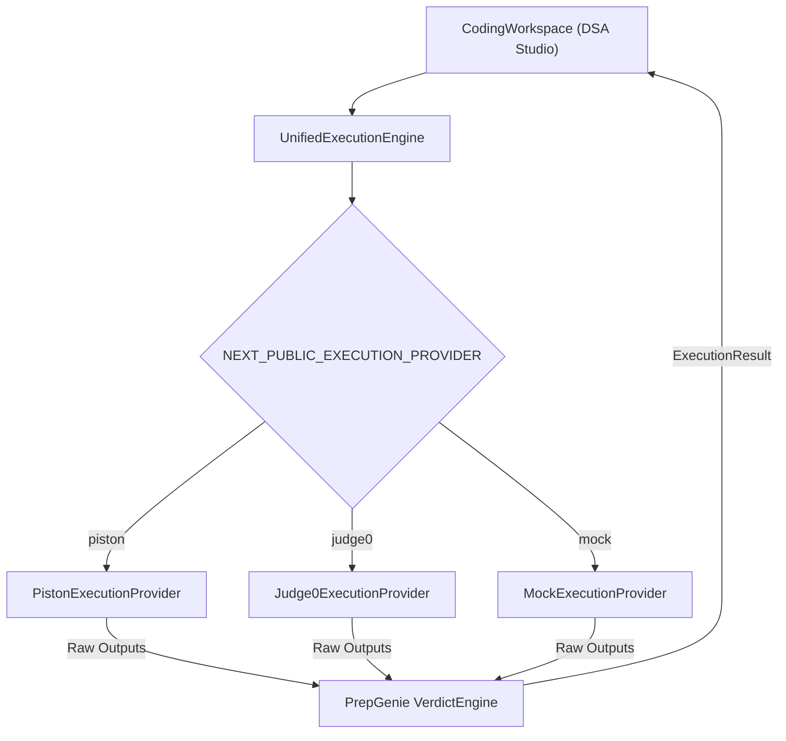

# PrepGenie Live Coding Execution Engine

This module powers code execution and verdict determination for PrepGenie's **DSA Studio**.

---

## Architecture Overview



### Core Design Principles
1. **Decoupled Architecture**: `CodingWorkspace` communicates solely with the `ExecutionProvider` interface. It has no knowledge of which specific execution engine is executing the code.
2. **PrepGenie Verdict Ownership**: Execution providers only execute code and return raw outputs (`stdout`, `stderr`, `compileOutput`, `time`, `memory`, `exitCode`, `signal`). PrepGenie's `VerdictEngine` compares outputs and determines verdicts: `Accepted`, `Wrong Answer`, `Compilation Error`, `Runtime Error`, `Time Limit Exceeded`.
3. **Environment-Based Switching**: Providers are selected cleanly via environment variables (`NEXT_PUBLIC_EXECUTION_PROVIDER`).

---

## Environment Variables

| Variable | Values / Default | Description |
| :--- | :--- | :--- |
| `NEXT_PUBLIC_EXECUTION_PROVIDER` | `piston` \| `judge0` \| `mock` (Default: `piston`) | Switches active execution engine |
| `NEXT_PUBLIC_PISTON_ENDPOINT` | `https://emkc.org/api/v2/piston` | Public or local Piston API URL |
| `NEXT_PUBLIC_JUDGE0_ENDPOINT` | `https://judge0-ce.p.rapidapi.com` | Judge0 API URL |
| `NEXT_PUBLIC_JUDGE0_API_KEY` | string (optional) | RapidAPI / custom host API key for Judge0 |

---

## Available Execution Providers

### 1. PistonProvider (`PistonExecutionProvider.ts`)
- **Default production & local engine**.
- **Languages Supported**: C++ (`cpp`), Python (`python`), Java (`java`), JavaScript (`javascript`).
- **Endpoint**: `https://emkc.org/api/v2/piston/execute` (or self-hosted local instance).
- Sends JSON payload and extracts raw stdout, stderr, compile errors, runtime, and exit status.

### 2. Judge0Provider (`Judge0ExecutionProvider.ts`)
- **Production-ready online judge provider**.
- If Judge0 credentials/endpoint exist, submits jobs asynchronously and polls for completion.
- If selected via `NEXT_PUBLIC_EXECUTION_PROVIDER=judge0` but credentials are missing, displays a explicit configuration error instead of failing silently.

### 3. MockProvider (`MockExecutionProvider.ts`)
- **Deterministic offline mock provider** for development and unit testing.
- Simulates execution errors based on code triggers (e.g. `// compile error`, `// tle`, `// wrong`).

---

## How to Switch Providers

To switch provider, set the environment variable in `.env.local` or host environment:

```bash
# To use Piston:
NEXT_PUBLIC_EXECUTION_PROVIDER=piston

# To use Judge0:
NEXT_PUBLIC_EXECUTION_PROVIDER=judge0

# To use Mock in local testing:
NEXT_PUBLIC_EXECUTION_PROVIDER=mock
```

Restart the Next.js development server after changing environment variables.

---

## Adding a New Provider

To add a new provider (e.g. `WasmProvider` or `SphereEngineProvider`):

1. Create `NewExecutionProvider.ts` in `helper/src/features/live-coding/execution/`.
2. Implement `runSingle(request)` and `runMultiple(request)` returning `RawExecutionOutput`:
   ```ts
   export interface RawExecutionOutput {
     stdout: string;
     stderr: string;
     compileOutput?: string;
     executionTimeMs?: number;
     memoryBytes?: number;
     exitCode?: number;
     signal?: string | null;
     timedOut?: boolean;
     isCompileError?: boolean;
   }
   ```
3. Register the new provider in `ExecutionEngine.ts` inside `UnifiedExecutionEngine`.
